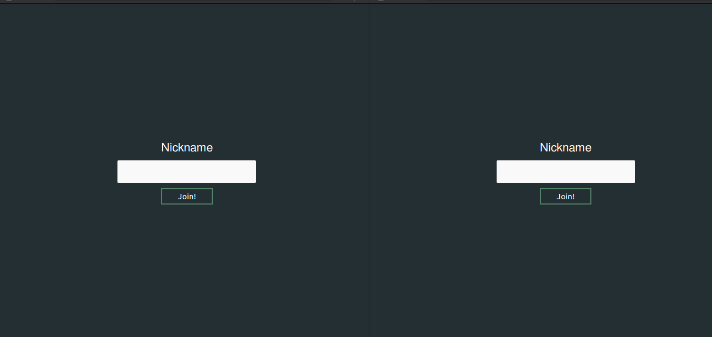

# simple chat app to learn socket io basics

:warning: the server code is writen in Es6, and requires node ^6.14.1

#### install and run:

- install the dependencies `npm install` or `yarn`
- run with command: `npm start` or `yarn start`
- and open `localhost:3000` on one or more browsers.

